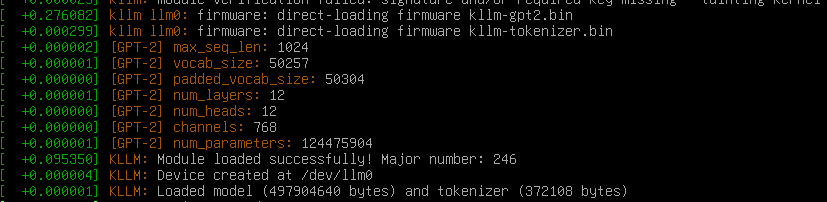

# `kllm`: Kernel-level LLM inference via `/dev/llm0`

*Ring 0 LLM inference! What can go wrong?*

**THIS IS A JOKE - DO NOT ACTUALLY USE THIS**

This repo ports a heavily-stripped down version of [llm.c](https://github.com/karpathy/llm.c) inference to the kernel. This currently *barely* works, and expect lots of timeouts and bugs. Only single-core CPU inference without any acceleration (SSE, AVX, etc.) is supported. Even for the 124M GPT-2 model, expect to wait 1m+ for a single token, during which time the system will be unresponsive.



## Building & Installing

```bash
make

# Download the GPT-2 checkpoints
./download_starter_pack.sh

# Copy the models to /lib/firmware
sudo cp gpt2_124M.bin /lib/firmware/kllm-gpt2.bin
sudo cp gpt2_tokenizer.bin /lib/firmware/kllm-tokenizer.bin

# Load the module
sudo insmod kllm.ko
```

## Usage

```bash
echo "Hello, world!" > /dev/llm0

# Responses will appear in `dmesg` for now. It should also be readable from `/dev/llm0`, but this is unstable.
```
